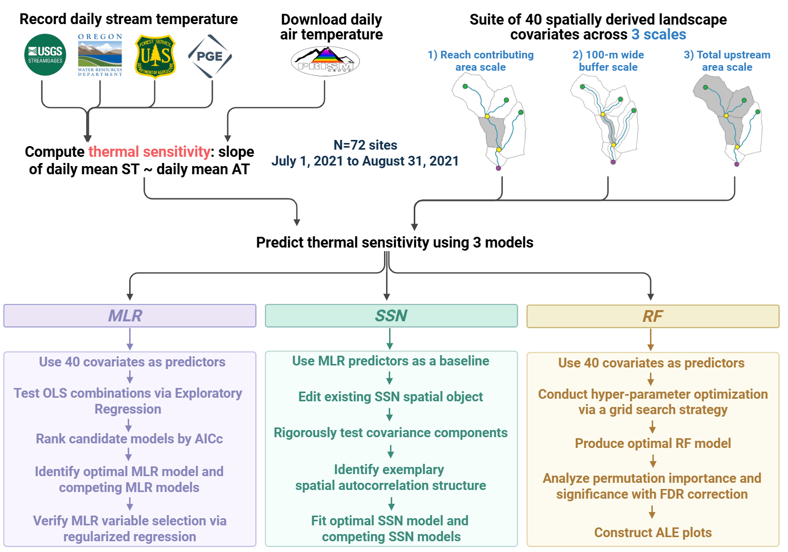
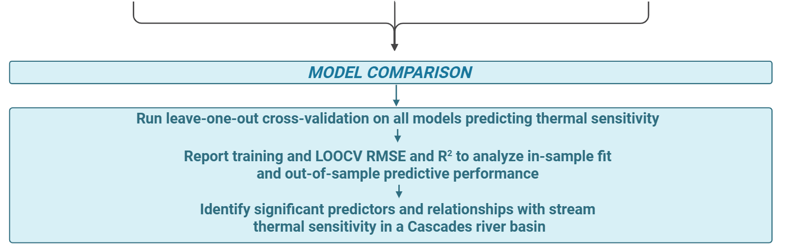

# What Controls the Spatial Variation in Thermal Sensitivity in a Cascades River Basin During an Extreme Heat Year?
Supporting dataset for "What Controls the Spatial Variation in Thermal Sensitivity in a Cascades River Basin During an Extreme Heat Year?" - Milburn et al., 2026. 

# Methodology

This research generates a new assessment of thermal sensitivity in the Clackamas River Basin, Oregon, USA by analyzing how underlying geology, climate, hydrology, and land cover explain spatial variation in stream thermal sensitivity. To investigate why specific locations in streams are more or less sensitive to changes in air temperature, we asked the following questions:
1) How can landscape and reach-scale characteristics explain spatial variation in thermal sensitivity of streams within a Ccascades river basin during an anomalously warm summer?
2) How do model performances and significant predictors explaining the spatial variation of thermal sensitivity converge or diverge across three different computational models (MLR, RF, SSN)?

# Code Structure
1) Regularized regression (ridge, LASSO, elastic net) to provide predictor stability from predictors identified by MLR variable selection procedure. 
2) SSN models: preprocessing, covariance spatial structure analysis, and fitting of SSN models using top-performing and two competing MLR formulas.
3) RF model: construction of top-performing RF model after HPO, permutation importance value significance testing, and construction of ALE plots.
4) Model comparison: LOOCV for three MLR models, three SSN models, and fixed RF model. 